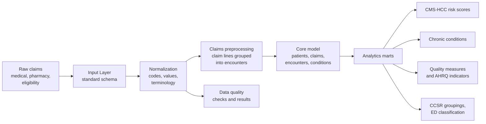

# Healthcare Claims Analytics Pipeline (dbt + DuckDB, Tuva Project)

An end-to-end claims data pipeline in dbt: raw, payer-style medical, pharmacy and eligibility claims go in, and a
standardized core data model, automated data quality results and ready-to-query analytics marts (risk scores, chronic
conditions, quality measures) come out. It runs on a laptop with DuckDB.

Built on the open-source [Tuva Project](https://thetuvaproject.com) (Tuva Core v1.0.0) over Tuva's synthetic
Medicare-style claims data. **1,455 dbt models, seeds and tests passed with zero errors across 21 schemas.**

## The problem
Every payer sends claims in its own layout, with its own codes and quirks. Before anyone can answer "how sick is this
population?" or "are we hitting our quality measures?", the data has to be mapped, cleaned, validated and modeled the
same way every time. This pipeline does that in one reproducible dbt build.

## Pipeline



## Results from the build

| Item | Value |
|---|---|
| dbt build | **1,455 nodes passed** (models, seeds, tests), 0 warnings, 0 errors |
| Patients in `core.patient` | **1,010** |
| Medical claim lines in `core.medical_claim` | **2,075** |
| Output schemas | **21** |
| Warehouse | DuckDB (single file, no server) |

Tables built per layer:

| Layer | Schemas (table count) |
|---|---|
| Ingestion and standardization | `input_layer` (31), `normalized_layer` (14), `terminology` (53), `value_sets` (48) |
| Transformation | `claims_preprocessing` (219), `intermediate` (15), `core` (23) |
| Data quality | `data_quality` (38) |
| Analytics marts | `cms_hcc` (16), `hcc_suspecting` (19), `hcc_recapture` (15), `chronic_conditions` (6), `quality_measures` (69), `ahrq_quality_indicators` (44), `ccsr` (11), `ed_classification` (3) |
| Serving and interoperability | `semantic_layer` (21), `fhir_preprocessing` (34), `provider_data` (5) |
| Other | `synthetic_data` (15), `metadata` (1) |

## What the marts answer
- **CMS-HCC risk scores:** how sick is each member, based on diagnosis codes and demographics, the same method Medicare
  uses to adjust payments.
- **HCC suspecting and recapture:** which members likely have a condition that isn't coded this year, and which
  previously coded conditions haven't been documented again.
- **Chronic conditions:** which members have diabetes, CHF, COPD and other chronic conditions, flagged from claims.
- **Quality measures and AHRQ indicators:** how the population performs on standard care-quality measures.
- **ED classification and CCSR:** what emergency visits were for, and diagnosis codes grouped into clinical categories.

## Onboarding a real payer feed
How I'd take this from synthetic data to production:
1. **Map the feed into the Input Layer** with source-specific dbt staging models: cast types and dates, standardize
   member and claim IDs, and keep one row per claim line.
2. **Gate on data quality first.** Review the `data_quality` results (missing member IDs, invalid codes, bad dates)
   and fail the load before bad data reaches the marts.
3. **Reconcile against source:** row counts and total paid amounts per file, so finance numbers tie out.
4. **Go incremental** with dbt incremental models keyed on claim ID and line, with a lookback window for claim
   adjustments and late-arriving claims.
5. **Orchestrate and deploy:** schedule the build in Airflow, run dbt tests in CI on every change, and move from DuckDB
   to Snowflake or Databricks for production volume (Tuva supports both).

## Repo contents
| Path | What it is |
|---|---|
| `scripts/run_tuva.sh` | One command: clones Tuva Core v1.0.0, installs dbt-duckdb, writes the profile, runs the full build with data quality enabled |
| `queries/explore.sql` | Queries to inspect the output: schemas built, core model size, every table per schema |

## Run it
```bash
./scripts/run_tuva.sh     # builds everything into tuva.duckdb
```
Requires Python 3 and git. For the larger synthetic dataset, add `synthetic_data_size: large` to the dbt vars in the script.

---
Tuva Project is licensed by Tuva Health under its open-source license; see the
[tuva-core repository](https://github.com/tuva-health/tuva-core).
